# Multi-Tenant AI Chatbot Builder

## The code stays private and will be shown as demo to recruiters only.

| Area                           | Final Choice / Flow                                                          | Tools We WILL Use                                                           | Tools We WILL NOT Use                           | Reason for Final Decision                                                                                                                             |
| ------------------------------ | ---------------------------------------------------------------------------- | --------------------------------------------------------------------------- | ----------------------------------------------- | ----------------------------------------------------------------------------------------------------------------------------------------------------- |
| Overall Architecture           | Lightweight CPU-only RAG chatbot architecture optimized for a 4GB RAM server | Go backend + Python ML microservice + Qdrant + Redis                        | Heavy monolithic AI stack                       | The server has strict RAM limits, so the architecture must stay modular, lightweight, and memory-efficient.                                           |
| Embedding Runtime              | ONNX-based embedding inference                                               | [FastEmbed](https://qdrant.tech/articles/fastembed/?utm_source=chatgpt.com) | PyTorch-based embedding runtime                 | FastEmbed uses ONNX Runtime and consumes dramatically less RAM compared to PyTorch.                                                                   |
| Embedding Framework            | Quantized ONNX inference                                                     | ONNX Runtime through FastEmbed                                              | Full `sentence-transformers` embedding pipeline | PyTorch alone can consume 600–800MB RAM, which is too expensive on a shared 4GB machine.                                                              |
| Embedding Model                | Lightweight semantic embedding model                                         | all-MiniLM-L6-v2                                                            | nomic-embed-text-v1.5                           | MiniLM-L6-v2 INT8 ONNX uses only ~22MB RAM and still provides strong retrieval quality for chatbot workloads.                                         |
| Vector Database                | Persistent semantic vector storage                                           | [Qdrant](https://qdrant.tech/?utm_source=chatgpt.com)                       | Pinecone, Weaviate cloud-first setups           | Qdrant is lightweight, self-hosted, memory-efficient, and supports quantization plus disk-based payload storage.                                      |
| Query Communication            | Persistent localhost API communication                                       | FastAPI + HTTP localhost calls                                              | Python subprocess per request                   | Subprocess spawning reloads models every request and introduces 2–5 second latency. Persistent services load models once and respond in milliseconds. |
| Go ↔ Python Integration        | Internal API architecture                                                    | FastAPI service running continuously                                        | `os.exec()` Python scripts                      | Persistent services are stable, concurrent, and production-safe compared to fragile subprocess pipes.                                                 |
| Retrieval Flow                 | Retrieve → rerank → answer                                                   | Qdrant top-10 retrieval + reranker                                          | Large retrieval sets like top-30                | Chatbots only need a few precise chunks. Smaller retrieval improves latency and reduces CPU usage.                                                    |
| Reranking                      | Lightweight CPU reranking                                                    | cross-encoder/ms-marco-MiniLM-L-6-v2                                        | Large rerankers like BGE-large or ColBERT       | Small rerankers provide strong ranking quality while staying inside memory limits.                                                                    |
| Chunk Strategy                 | Small focused chunks                                                         | 128–256 token chunking                                                      | Large 512–1024 token chunks                     | Small chunks improve retrieval precision and reduce reranker computation time.                                                                        |
| Cache Strategy                 | Query embedding cache                                                        | Python LRU cache (`lru_cache`)                                              | No caching                                      | Chatbots receive repeated questions frequently. Caching eliminates repeated embedding generation costs.                                               |
| API Runtime                    | Single-worker inference runtime                                              | FastAPI + Uvicorn (1 worker)                                                | Multiple Uvicorn workers                        | Multiple workers duplicate models in RAM and can crash the server due to memory exhaustion.                                                           |
| CPU Parallelism                | Internal ONNX threading                                                      | ONNX Runtime threading                                                      | Worker-based multiprocessing                    | ONNX already parallelizes internally across CPU cores efficiently.                                                                                    |
| Deployment Pattern             | Memory-constrained Docker deployment                                         | Docker Compose with RAM limits                                              | Unlimited containers                            | Hard memory limits prevent runaway RAM usage and improve server stability.                                                                            |
| Storage Optimization           | Quantized vector storage                                                     | Qdrant INT8 scalar quantization                                             | Full precision float vectors everywhere         | Quantization reduces vector RAM usage by nearly 8× with minimal quality loss.                                                                         |
| Payload Storage                | Disk-backed payloads                                                         | Qdrant `on_disk_payload=true`                                               | Full in-memory payload storage                  | Payloads are less latency-sensitive and should not consume valuable RAM.                                                                              |
| Redis Usage                    | Lightweight cache/session layer                                              | [Redis](https://redis.io/?utm_source=chatgpt.com)                           | Heavy distributed cache systems                 | Redis is lightweight and sufficient for chatbot session and cache workloads.                                                                          |
| Backend Language               | Main orchestration layer                                                     | Go                                                                          | Python-only backend                             | Go provides low memory usage, excellent concurrency, and strong API performance.                                                                      |
| ML Language                    | Dedicated inference layer                                                    | Python                                                                      | Rewriting ML in Go                              | Python ML ecosystem support is significantly stronger and more mature.                                                                                |
| Retrieval Scale                | Chatbot-focused retrieval                                                    | Top-10 retrieval → top-3 final context                                      | Massive context retrieval pipelines             | Chatbots generate short answers and do not need large context windows.                                                                                |
| Small Dataset Optimization     | Conditional reranker skipping                                                | Skip rerank if chunk count <1000                                            | Always reranking everything                     | Small collections already retrieve accurately with HNSW search, so reranking wastes CPU cycles.                                                       |
| Scalability Strategy           | Vertical efficiency first                                                    | Optimized lightweight services                                              | Kubernetes-scale orchestration                  | The server constraints make lightweight optimization more important than distributed scaling complexity.                                              |
| Memory Management              | Strict RAM budgeting                                                         | Docker memory caps + quantization + ONNX                                    | Unbounded PyTorch inference                     | The architecture is specifically designed to stay safely below 4GB RAM usage.                                                                         |
| Startup Strategy               | Load models once at boot                                                     | Persistent ML service                                                       | Reloading models repeatedly                     | Model initialization is expensive and must happen only once for low-latency chatbot responses.                                                        |
| Latency Goal                   | Millisecond-level retrieval                                                  | FastEmbed + cached embeddings + small reranking                             | Heavy transformer inference                     | Chatbots require fast interactive response times, not heavy offline-grade retrieval quality.                                                          |
| Final Architectural Philosophy | Lightweight precision-first chatbot RAG                                      | Go + FastEmbed + Qdrant + Redis + FastAPI                                   | Heavy GPU-style enterprise ML stacks            | The system is optimized for constrained hardware, stable uptime, low latency, and efficient semantic retrieval.                                       |

---

# Chat.bo — Mermaid Diagrams

> Complete visual coverage of every system, flow, and interaction in the Chat.bo platform.

---

## Table of Contents

- [Multi-Tenant AI Chatbot Builder](#multi-tenant-ai-chatbot-builder)
  - [The code stays private and will be shown as demo to recruiters only.](#the-code-stays-private-and-will-be-shown-as-demo-to-recruiters-only)
- [Chat.bo — Mermaid Diagrams](#chatbo--mermaid-diagrams)
  - [Table of Contents](#table-of-contents)
  - [1. System Architecture Overview](#1-system-architecture-overview)
  - [2. Startup Sequence](#2-startup-sequence)
  - [3. Directory \& Module Structure](#3-directory--module-structure)
  - [4. Database Entity Relationship](#4-database-entity-relationship)
  - [5. HTTP Route Map](#5-http-route-map)
  - [6. Middleware Chain](#6-middleware-chain)
  - [7. Admin Chat Flow (Playground)](#7-admin-chat-flow-playground)
  - [8. Public Widget Chat Flow](#8-public-widget-chat-flow)
  - [9. RAG Pipeline — Indexing](#9-rag-pipeline--indexing)
  - [10. RAG Pipeline — Retrieval](#10-rag-pipeline--retrieval)
  - [11. LLM Provider Routing](#11-llm-provider-routing)
  - [12. Knowledge Base Build \& Retrain Flow](#12-knowledge-base-build--retrain-flow)
  - [13. Data Source Ingestion](#13-data-source-ingestion)
  - [14. Website Crawler Flow](#14-website-crawler-flow)
  - [15. Sentiment Analysis Flow](#15-sentiment-analysis-flow)
  - [16. Topic Classification Flow](#16-topic-classification-flow)
  - [17. Lead Capture System](#17-lead-capture-system)
  - [18. Telegram Integration Flow](#18-telegram-integration-flow)
  - [19. Widget Embedding System](#19-widget-embedding-system)
  - [20. Frontend App Bootstrap](#20-frontend-app-bootstrap)
  - [21. Frontend Page \& Component Tree](#21-frontend-page--component-tree)
  - [22. Analytics Data Flow](#22-analytics-data-flow)
  - [23. Contacts Flow](#23-contacts-flow)
  - [24. Session \& Daily Stats Update Flow](#24-session--daily-stats-update-flow)
  - [25. Complete Request Lifecycle](#25-complete-request-lifecycle)

---

## 1. System Architecture Overview

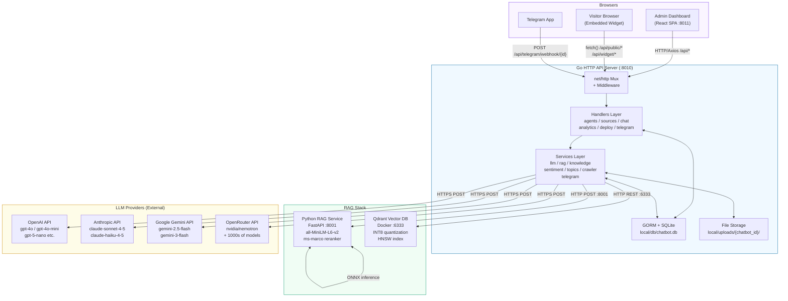
```mermaid
graph TB
    subgraph Browsers["Browsers"]
        Admin["Admin Dashboard\n(React SPA :8011)"]
        Visitor["Visitor Browser\n(Embedded Widget)"]
        TelegramApp["Telegram App"]
    end

    subgraph GoAPI["Go HTTP API Server (:8010)"]
        Router["net/http Mux\n+ Middleware"]
        Handlers["Handlers Layer\nagents / sources / chat\nanalytics / deploy / telegram"]
        Services["Services Layer\nllm / rag / knowledge\nsentiment / topics / crawler\ntelegram"]
        DB["GORM + SQLite\nlocal/db/chatbot.db"]
        Files["File Storage\nlocal/uploads/{chatbot_id}/"]
    end

    subgraph RAGStack["RAG Stack"]
        Python["Python RAG Service\nFastAPI :8001\nall-MiniLM-L6-v2\nms-marco reranker"]
        Qdrant["Qdrant Vector DB\nDocker :6333\nINT8 quantization\nHNSW index"]
    end

    subgraph LLMProviders["LLM Providers (External)"]
        OpenAI["OpenAI API\ngpt-4o / gpt-4o-mini\ngpt-5-nano etc."]
        Anthropic["Anthropic API\nclaude-sonnet-4-5\nclaude-haiku-4-5"]
        Gemini["Google Gemini API\ngemini-2.5-flash\ngemini-3-flash"]
        OpenRouter["OpenRouter API\nnvidia/nemotron\n+ 1000s of models"]
    end

    Admin -- "HTTP/Axios /api/*" --> Router
    Visitor -- "fetch() /api/public/*\n/api/widget/*" --> Router
    TelegramApp -- "POST /api/telegram/webhook/{id}" --> Router

    Router --> Handlers
    Handlers --> Services
    Handlers <--> DB
    Services <--> DB
    Services <--> Files

    Services -- "HTTP POST :8001" --> Python
    Python <-- "ONNX inference" --> Python
    Services -- "HTTP REST :6333" --> Qdrant

    Services -- "HTTPS POST" --> OpenAI
    Services -- "HTTPS POST" --> Anthropic
    Services -- "HTTPS POST" --> Gemini
    Services -- "HTTPS POST" --> OpenRouter

    style GoAPI fill:#f0f9ff,stroke:#0369a1
    style RAGStack fill:#f0fdf4,stroke:#059669
    style LLMProviders fill:#fefce8,stroke:#ca8a04
    style Browsers fill:#faf5ff,stroke:#7c3aed
```

---

## 2. Startup Sequence

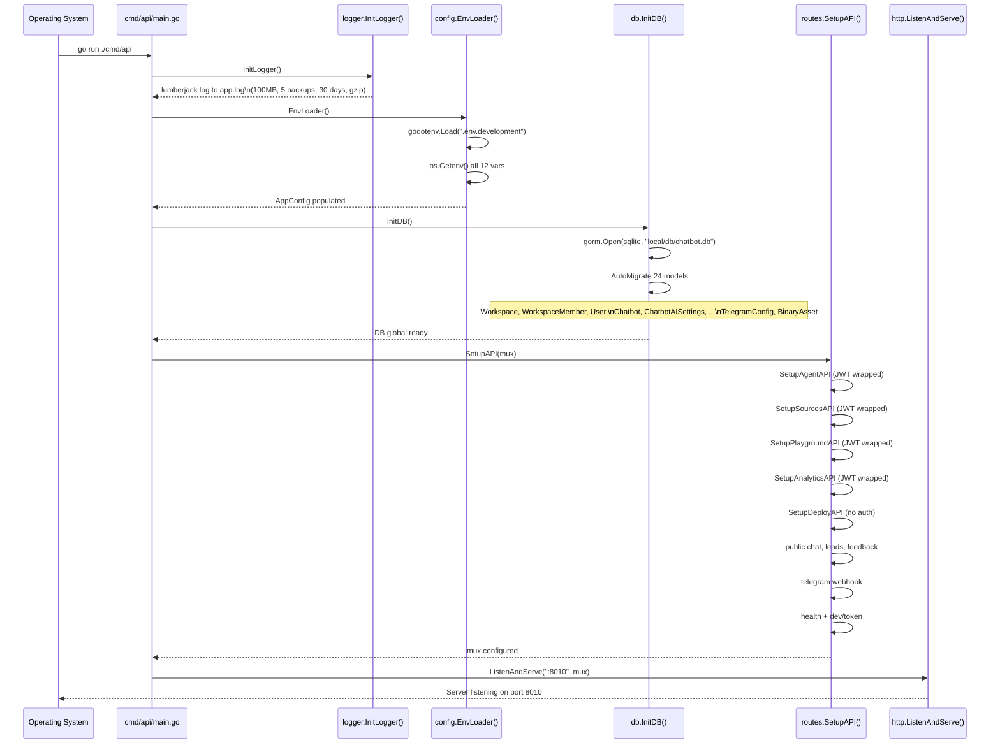
```mermaid
sequenceDiagram
    participant OS as Operating System
    participant Main as cmd/api/main.go
    participant Logger as logger.InitLogger()
    participant Config as config.EnvLoader()
    participant DB as db.InitDB()
    participant Routes as routes.SetupAPI()
    participant HTTP as http.ListenAndServe()

    OS->>Main: go run ./cmd/api
    Main->>Logger: InitLogger()
    Logger-->>Main: lumberjack log to app.log\n(100MB, 5 backups, 30 days, gzip)
    Main->>Config: EnvLoader()
    Config->>Config: godotenv.Load(".env.development")
    Config->>Config: os.Getenv() all 12 vars
    Config-->>Main: AppConfig populated
    Main->>DB: InitDB()
    DB->>DB: gorm.Open(sqlite, "local/db/chatbot.db")
    DB->>DB: AutoMigrate 24 models
    Note over DB: Workspace, WorkspaceMember, User,\nChatbot, ChatbotAISettings, ...\nTelegramConfig, BinaryAsset
    DB-->>Main: DB global ready
    Main->>Routes: SetupAPI(mux)
    Routes->>Routes: SetupAgentAPI (JWT wrapped)
    Routes->>Routes: SetupSourcesAPI (JWT wrapped)
    Routes->>Routes: SetupPlaygroundAPI (JWT wrapped)
    Routes->>Routes: SetupAnalyticsAPI (JWT wrapped)
    Routes->>Routes: SetupDeployAPI (no auth)
    Routes->>Routes: public chat, leads, feedback
    Routes->>Routes: telegram webhook
    Routes->>Routes: health + dev/token
    Routes-->>Main: mux configured
    Main->>HTTP: ListenAndServe(":8010", mux)
    HTTP-->>OS: Server listening on port 8010
```

---

## 3. Directory & Module Structure

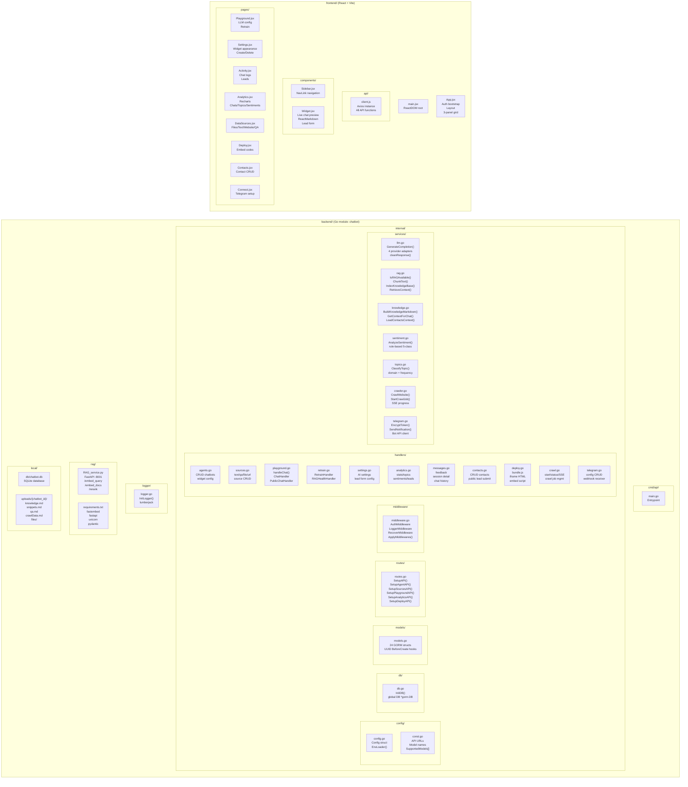
```mermaid
graph LR
    subgraph Backend["backend/ (Go module: chatbot)"]
        subgraph cmd["cmd/api/"]
            main["main.go\nEntrypoint"]
        end
        subgraph internal["internal/"]
            subgraph config["config/"]
                cfg["config.go\nConfig struct\nEnvLoader()"]
                consts["const.go\nAPI URLs\nModel names\nSupportedModels[]"]
            end
            subgraph db["db/"]
                dbgo["db.go\nInitDB()\nglobal DB *gorm.DB"]
            end
            subgraph models["models/"]
                mgo["models.go\n24 GORM structs\nUUID BeforeCreate hooks"]
            end
            subgraph routes["routes/"]
                rgo["routes.go\nSetupAPI()\nSetupAgentAPI()\nSetupSourcesAPI()\nSetupPlaygroundAPI()\nSetupAnalyticsAPI()\nSetupDeployAPI()"]
            end
            subgraph middleware["middleware/"]
                mw["middleware.go\nAuthMiddleware\nLoggerMiddleware\nRecoverMiddleware\nApplyMiddlewares()"]
            end
            subgraph handlers["handlers/"]
                agents_h["agents.go\nCRUD chatbots\nwidget config"]
                sources_h["sources.go\ntext/qa/file/url\nsource CRUD"]
                playground_h["playground.go\nhandleChat()\nChatHandler\nPublicChatHandler"]
                retrain_h["retrain.go\nRetrainHandler\nRAGHealthHandler"]
                settings_h["settings.go\nAI settings\nlead form config"]
                analytics_h["analytics.go\nstats/topics\nsentiments/leads"]
                messages_h["messages.go\nfeedback\nsession detail\nchat history"]
                contacts_h["contacts.go\nCRUD contacts\npublic lead submit"]
                deploy_h["deploy.go\nbundle.js\niframe HTML\nembed script"]
                crawl_h["crawl.go\nstart/status/SSE\ncrawl job mgmt"]
                telegram_h["telegram.go\nconfig CRUD\nwebhook receiver"]
            end
            subgraph services["services/"]
                llm_s["llm.go\nGenerateCompletion()\n4 provider adapters\ncleanResponse()"]
                rag_s["rag.go\nIsRAGAvailable()\nChunkText()\nIndexKnowledgeBase()\nRetrieveContext()"]
                knowledge_s["knowledge.go\nBuildKnowledgeMarkdown()\nGetContextForChat()\nLoadContactsContext()"]
                sentiment_s["sentiment.go\nAnalyzeSentiment()\nrule-based 5-class"]
                topics_s["topics.go\nClassifyTopic()\ndomain + frequency"]
                crawler_s["crawler.go\nCrawlWebsite()\nStartCrawlJob()\nSSE progress"]
                telegram_s["telegram.go\nEncryptToken()\nSendNotification()\nBot API client"]
            end
        end
        subgraph logger["logger/"]
            loggo["logger.go\nInitLogger()\nlumberjack"]
        end
        subgraph rag["rag/"]
            ragpy["RAG_service.py\nFastAPI :8001\n/embed_query\n/embed_docs\n/rerank"]
            reqs["requirements.txt\nfastembed\nfastapi\nuvicorn\npydantic"]
        end
        subgraph local["local/"]
            dbfile["db/chatbot.db\nSQLite database"]
            uploads["uploads/{chatbot_id}/\nknowledge.md\nsnippets.md\nqa.md\ncrawlData.md\nfiles/"]
        end
    end

    subgraph Frontend["frontend/ (React + Vite)"]
        mainjs["main.jsx\nReactDOM root"]
        appjs["App.jsx\nAuth bootstrap\nLayout\n3-panel grid"]
        subgraph api_dir["api/"]
            clientjs["client.js\nAxios instance\nAll API functions"]
        end
        subgraph components_dir["components/"]
            sidebar["Sidebar.jsx\nNavLink navigation"]
            widget_cmp["Widget.jsx\nLive chat preview\nReactMarkdown\nLead form"]
        end
        subgraph pages_dir["pages/"]
            pg["Playground.jsx\nLLM config\nRetrain"]
            st["Settings.jsx\nWidget appearance\nCreate/Delete"]
            act["Activity.jsx\nChat logs\nLeads"]
            an["Analytics.jsx\nRecharts\nChats/Topics/Sentiments"]
            ds["DataSources.jsx\nFiles/Text/Website/QA"]
            dep["Deploy.jsx\nEmbed codes"]
            con["Contacts.jsx\nContact CRUD"]
            conn["Connect.jsx\nTelegram setup"]
        end
    end
```

---

## 4. Database Entity Relationship

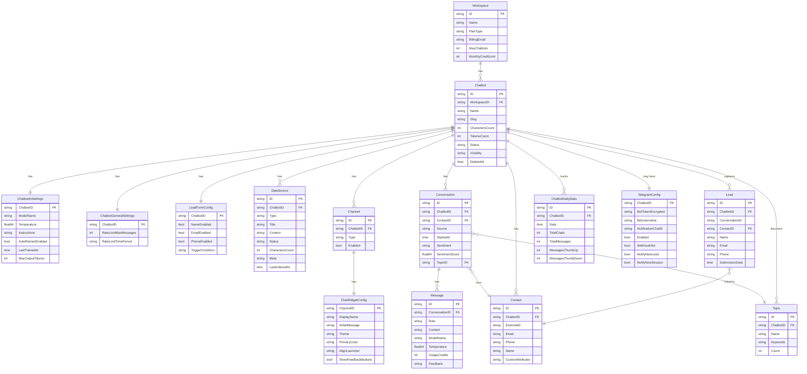
```mermaid
erDiagram
    Workspace {
        string ID PK
        string Name
        string PlanType
        string BillingEmail
        int MaxChatbots
        int MonthlyCreditLimit
    }

    Chatbot {
        string ID PK
        string WorkspaceID FK
        string Name
        string Slug
        int CharactersCount
        int TokensCount
        string Status
        string Visibility
        time DeletedAt
    }

    ChatbotAISettings {
        string ChatbotID PK
        string ModelName
        float64 Temperature
        string Instructions
        bool AutoRetrainEnabled
        time LastTrainedAt
        int MaxOutputTokens
    }

    ChatbotGeneralSettings {
        string ChatbotID PK
        int RateLimitMaxMessages
        string RateLimitTimePeriod
    }

    LeadFormConfig {
        string ChatbotID PK
        bool NameEnabled
        bool EmailEnabled
        bool PhoneEnabled
        string TriggerCondition
    }

    DataSource {
        string ID PK
        string ChatbotID FK
        string Type
        string Title
        string Content
        string Status
        int CharactersCount
        string Meta
        time LastIndexedAt
    }

    Channel {
        string ID PK
        string ChatbotID FK
        string Type
        bool Enabled
    }

    ChatWidgetConfig {
        string ChannelID PK
        string DisplayName
        string InitialMessage
        string Theme
        string PrimaryColor
        string AlignLauncher
        bool ShowFeedbackButtons
    }

    Conversation {
        string ID PK
        string ChatbotID FK
        string ContactID FK
        string Source
        time StartedAt
        string Sentiment
        float64 SentimentScore
        string TopicID FK
    }

    Message {
        string ID PK
        string ConversationID FK
        string Role
        string Content
        string ModelName
        float64 Temperature
        int UsageCredits
        string Feedback
    }

    Contact {
        string ID PK
        string ChatbotID FK
        string ExternalID
        string Email
        string Phone
        string Name
        string CustomAttributes
    }

    Lead {
        string ID PK
        string ChatbotID FK
        string ConversationID
        string ContactID FK
        string Name
        string Email
        string Phone
        time SubmissionDate
    }

    Topic {
        string ID PK
        string ChatbotID FK
        string Name
        string Keywords
        int Count
    }

    ChatbotDailyStats {
        string ID PK
        string ChatbotID FK
        time Date
        int TotalChats
        int TotalMessages
        int MessagesThumbUp
        int MessagesThumbDown
    }

    TelegramConfig {
        string ChatbotID PK
        string BotTokenEncrypted
        string BotUsername
        string NotificationChatID
        bool Enabled
        bool WebhookSet
        bool NotifyNewLead
        bool NotifyNewSession
    }

    Workspace ||--o{ Chatbot : "has"
    Chatbot ||--|| ChatbotAISettings : "has"
    Chatbot ||--|| ChatbotGeneralSettings : "has"
    Chatbot ||--|| LeadFormConfig : "has"
    Chatbot ||--o{ DataSource : "has"
    Chatbot ||--o{ Channel : "has"
    Channel ||--|| ChatWidgetConfig : "has"
    Chatbot ||--o{ Conversation : "has"
    Conversation ||--o{ Message : "has"
    Conversation }o--|| Contact : "from"
    Conversation }o--|| Topic : "about"
    Chatbot ||--o{ Contact : "has"
    Chatbot ||--o{ Lead : "captures"
    Lead }o--|| Contact : "linked to"
    Chatbot ||--o{ Topic : "discovers"
    Chatbot ||--o{ ChatbotDailyStats : "tracks"
    Chatbot ||--|| TelegramConfig : "may have"
```

---

## 5. HTTP Route Map

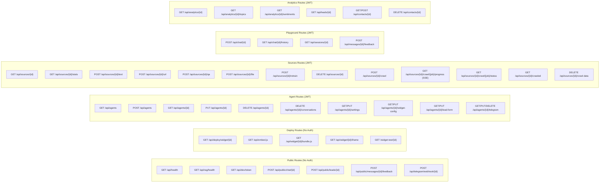
```mermaid
graph LR
    subgraph Public["Public Routes (No Auth)"]
        P1["GET /api/health"]
        P2["GET /api/rag/health"]
        P3["GET /api/dev/token"]
        P4["POST /api/public/chat/{id}"]
        P5["POST /api/public/leads/{id}"]
        P6["POST /api/public/messages/{id}/feedback"]
        P7["POST /api/telegram/webhook/{id}"]
    end

    subgraph Deploy["Deploy Routes (No Auth)"]
        D1["GET /api/deploy/widget/{id}"]
        D2["GET /api/embed.js"]
        D3["GET /api/widget/{id}/bundle.js"]
        D4["GET /api/widget/{id}/iframe"]
        D5["GET /widget-test/{id}"]
    end

    subgraph Agents["Agent Routes (JWT)"]
        A1["GET /api/agents"]
        A2["POST /api/agents"]
        A3["GET /api/agents/{id}"]
        A4["PUT /api/agents/{id}"]
        A5["DELETE /api/agents/{id}"]
        A6["DELETE /api/agents/{id}/conversations"]
        A7["GET/PUT /api/agents/{id}/settings"]
        A8["GET/PUT /api/agents/{id}/widget-config"]
        A9["GET/PUT /api/agents/{id}/lead-form"]
        A10["GET/PUT/DELETE /api/agents/{id}/telegram"]
    end

    subgraph Sources["Sources Routes (JWT)"]
        S1["GET /api/sources/{id}"]
        S2["GET /api/sources/{id}/stats"]
        S3["POST /api/sources/{id}/text"]
        S4["POST /api/sources/{id}/url"]
        S5["POST /api/sources/{id}/qa"]
        S6["POST /api/sources/{id}/file"]
        S7["POST /api/sources/{id}/retrain"]
        S8["DELETE /api/sources/{id}"]
        S9["POST /api/sources/{id}/crawl"]
        S10["GET /api/sources/{id}/crawl/{job}/progress (SSE)"]
        S11["GET /api/sources/{id}/crawl/{job}/status"]
        S12["GET /api/sources/{id}/crawled"]
        S13["DELETE /api/sources/{id}/crawl-data"]
    end

    subgraph Playground["Playground Routes (JWT)"]
        PL1["POST /api/chat/{id}"]
        PL2["GET /api/chat/{id}/history"]
        PL3["GET /api/sessions/{id}"]
        PL4["POST /api/messages/{id}/feedback"]
    end

    subgraph Analytics["Analytics Routes (JWT)"]
        AN1["GET /api/analytics/{id}"]
        AN2["GET /api/analytics/{id}/topics"]
        AN3["GET /api/analytics/{id}/sentiments"]
        AN4["GET /api/leads/{id}"]
        AN5["GET/POST /api/contacts/{id}"]
        AN6["DELETE /api/contacts/{id}"]
    end
```

---

## 6. Middleware Chain

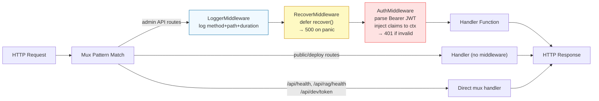
```mermaid
flowchart LR
    Req["HTTP Request"] --> MuxMatch["Mux Pattern Match"]

    MuxMatch -- "admin API routes" --> Logger
    Logger["LoggerMiddleware\nlog method+path+duration"] --> Recover
    Recover["RecoverMiddleware\ndefer recover()\n→ 500 on panic"] --> Auth
    Auth["AuthMiddleware\nparse Bearer JWT\ninject claims to ctx\n→ 401 if invalid"] --> Handler
    Handler["Handler Function"] --> Resp["HTTP Response"]

    MuxMatch -- "public/deploy routes" --> PubHandler["Handler (no middleware)"] --> Resp

    MuxMatch -- "/api/health, /api/rag/health\n/api/dev/token" --> DirectHandler["Direct mux handler"] --> Resp

    style Auth fill:#fee2e2,stroke:#ef4444
    style Logger fill:#f0f9ff,stroke:#0369a1
    style Recover fill:#fef9c3,stroke:#ca8a04
```

---

## 7. Admin Chat Flow (Playground)

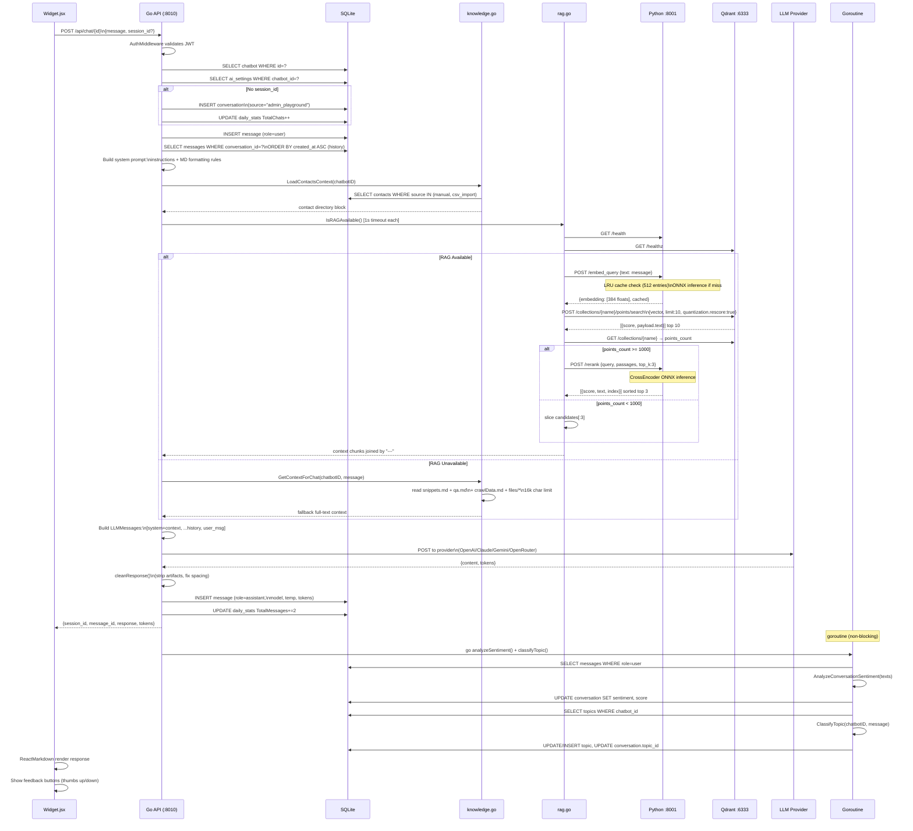
```mermaid
sequenceDiagram
    participant W as Widget.jsx
    participant API as Go API (:8010)
    participant DB as SQLite
    participant KnowSvc as knowledge.go
    participant RAGSvc as rag.go
    participant PySvc as Python :8001
    participant Qdrant as Qdrant :6333
    participant LLM as LLM Provider
    participant Async as Goroutine

    W->>API: POST /api/chat/{id}\n{message, session_id?}
    API->>API: AuthMiddleware validates JWT
    API->>DB: SELECT chatbot WHERE id=?
    API->>DB: SELECT ai_settings WHERE chatbot_id=?

    alt No session_id
        API->>DB: INSERT conversation\n(source="admin_playground")
        API->>DB: UPDATE daily_stats TotalChats++
    end

    API->>DB: INSERT message (role=user)
    API->>DB: SELECT messages WHERE conversation_id=?\nORDER BY created_at ASC (history)

    API->>API: Build system prompt:\ninstructions + MD formatting rules
    API->>KnowSvc: LoadContactsContext(chatbotID)
    KnowSvc->>DB: SELECT contacts WHERE source IN (manual, csv_import)
    KnowSvc-->>API: contact directory block

    API->>RAGSvc: IsRAGAvailable() [1s timeout each]
    RAGSvc->>PySvc: GET /health
    RAGSvc->>Qdrant: GET /healthz

    alt RAG Available
        RAGSvc->>PySvc: POST /embed_query {text: message}
        Note over PySvc: LRU cache check (512 entries)\nONNX inference if miss
        PySvc-->>RAGSvc: {embedding: [384 floats], cached}
        RAGSvc->>Qdrant: POST /collections/{name}/points/search\n{vector, limit:10, quantization.rescore:true}
        Qdrant-->>RAGSvc: [{score, payload.text}] top 10
        RAGSvc->>Qdrant: GET /collections/{name} → points_count
        alt points_count >= 1000
            RAGSvc->>PySvc: POST /rerank {query, passages, top_k:3}
            Note over PySvc: CrossEncoder ONNX inference
            PySvc-->>RAGSvc: [{score, text, index}] sorted top 3
        else points_count < 1000
            RAGSvc->>RAGSvc: slice candidates[:3]
        end
        RAGSvc-->>API: context chunks joined by "---"
    else RAG Unavailable
        API->>KnowSvc: GetContextForChat(chatbotID, message)
        KnowSvc->>KnowSvc: read snippets.md + qa.md\n+ crawlData.md + files/*\n16k char limit
        KnowSvc-->>API: fallback full-text context
    end

    API->>API: Build LLMMessages:\n[system+context, ...history, user_msg]
    API->>LLM: POST to provider\n(OpenAI/Claude/Gemini/OpenRouter)
    LLM-->>API: {content, tokens}
    API->>API: cleanResponse()\n(strip artifacts, fix spacing)

    API->>DB: INSERT message (role=assistant,\nmodel, temp, tokens)
    API->>DB: UPDATE daily_stats TotalMessages+=2

    API-->>W: {session_id, message_id, response, tokens}

    Note over Async: goroutine (non-blocking)
    API->>Async: go analyzeSentiment() + classifyTopic()
    Async->>DB: SELECT messages WHERE role=user
    Async->>Async: AnalyzeConversationSentiment(texts)
    Async->>DB: UPDATE conversation SET sentiment, score
    Async->>DB: SELECT topics WHERE chatbot_id
    Async->>Async: ClassifyTopic(chatbotID, message)
    Async->>DB: UPDATE/INSERT topic, UPDATE conversation.topic_id

    W->>W: ReactMarkdown render response
    W->>W: Show feedback buttons (thumbs up/down)
```

---

## 8. Public Widget Chat Flow

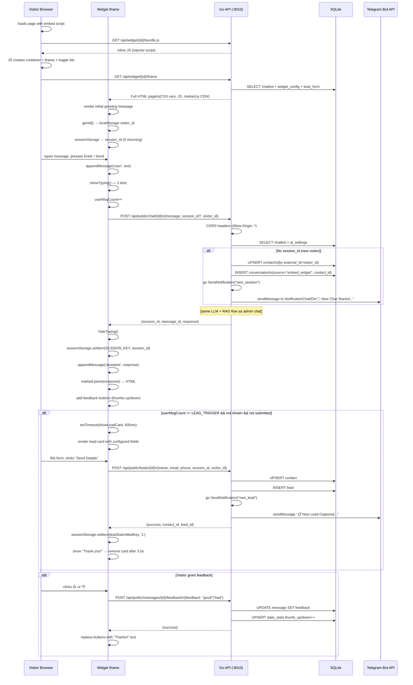
```mermaid
sequenceDiagram
    participant Visitor as Visitor Browser
    participant iframe as Widget iframe
    participant API as Go API (:8010)
    participant DB as SQLite
    participant Telegram as Telegram Bot API

    Visitor->>Visitor: loads page with embed script
    Visitor->>API: GET /api/widget/{id}/bundle.js
    API-->>Visitor: inline JS (injector script)
    Visitor->>Visitor: JS creates container + iframe + toggle btn

    Visitor->>API: GET /api/widget/{id}/iframe
    API->>DB: SELECT chatbot + widget_config + lead_form
    API-->>iframe: Full HTML page\n(CSS vars, JS, marked.js CDN)

    iframe->>iframe: render initial greeting message
    iframe->>iframe: genId() → localStorage visitor_id
    iframe->>iframe: sessionStorage → session_id (if returning)

    Visitor->>iframe: types message, presses Enter / Send
    iframe->>iframe: appendMessage('user', text)
    iframe->>iframe: showTyping() — 3 dots
    iframe->>iframe: userMsgCount++

    iframe->>API: POST /api/public/chat/{id}\n{message, session_id?, visitor_id}
    API->>API: CORS headers (Allow-Origin: *)
    API->>DB: SELECT chatbot + ai_settings

    alt No session_id (new visitor)
        API->>DB: UPSERT contact\n(by external_id=visitor_id)
        API->>DB: INSERT conversation\n(source="embed_widget", contact_id)
        API->>API: go SendNotification("new_session")
        API->>Telegram: sendMessage to NotificationChatID\n"💬 New Chat Started..."
    end

    Note over API: [same LLM + RAG flow as admin chat]
    API-->>iframe: {session_id, message_id, response}

    iframe->>iframe: hideTyping()
    iframe->>iframe: sessionStorage.setItem(SESSION_KEY, session_id)
    iframe->>iframe: appendMessage('assistant', response)
    iframe->>iframe: marked.parse(response) → HTML
    iframe->>iframe: add feedback buttons (thumbs up/down)

    alt userMsgCount >= LEAD_TRIGGER && not shown && not submitted
        iframe->>iframe: setTimeout(showLeadCard, 600ms)
        iframe->>iframe: render lead-card with configured fields
        Visitor->>iframe: fills form, clicks "Send Details"
        iframe->>API: POST /api/public/leads/{id}\n{name, email, phone, session_id, visitor_id}
        API->>DB: UPSERT contact
        API->>DB: INSERT lead
        API->>API: go SendNotification("new_lead")
        API->>Telegram: sendMessage "📋 New Lead Captured..."
        API-->>iframe: {success, contact_id, lead_id}
        iframe->>iframe: sessionStorage.setItem(leadSubmittedKey, '1')
        iframe->>iframe: show "Thank you!" → remove card after 3.5s
    end

    opt Visitor gives feedback
        Visitor->>iframe: clicks 👍 or 👎
        iframe->>API: POST /api/public/messages/{id}/feedback\n{feedback: "good"|"bad"}
        API->>DB: UPDATE message SET feedback
        API->>DB: UPSERT daily_stats thumb_up/down++
        API-->>iframe: {success}
        iframe->>iframe: replace buttons with "Thanks!" text
    end
```

---

## 9. RAG Pipeline — Indexing

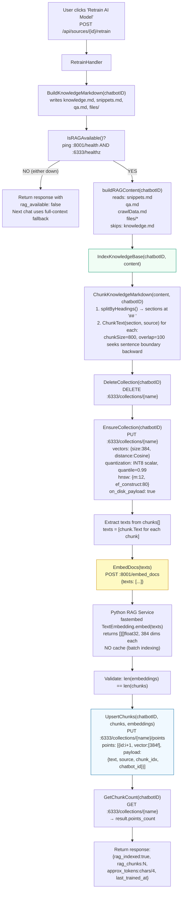
```mermaid
flowchart TD
    A["User clicks 'Retrain AI Model'\nPOST /api/sources/{id}/retrain"] --> B

    B["RetrainHandler"]
    B --> C["BuildKnowledgeMarkdown(chatbotID)\nwrites knowledge.md, snippets.md,\nqa.md, files/"]

    C --> D["IsRAGAvailable()?\nping :8001/health AND :6333/healthz"]

    D -- "NO (either down)" --> E["Return response with\nrag_available: false\nNext chat uses full-context fallback"]

    D -- "YES" --> F["buildRAGContent(chatbotID)\nreads: snippets.md\nqa.md\ncrawlData.md\nfiles/*\nskips: knowledge.md"]

    F --> G["IndexKnowledgeBase(chatbotID, content)"]

    G --> H["ChunkKnowledgeMarkdown(content, chatbotID)\n1. splitByHeadings() → sections at '## '\n2. ChunkText(section, source) for each:\n   chunkSize=800, overlap=100\n   seeks sentence boundary backward"]

    H --> I["DeleteCollection(chatbotID)\nDELETE :6333/collections/{name}"]

    I --> J["EnsureCollection(chatbotID)\nPUT :6333/collections/{name}\nvectors: {size:384, distance:Cosine}\nquantization: INT8 scalar, quantile=0.99\nhnsw: {m:12, ef_construct:80}\non_disk_payload: true"]

    J --> K["Extract texts from chunks[]\ntexts = [chunk.Text for each chunk]"]

    K --> L["EmbedDocs(texts)\nPOST :8001/embed_docs\n{texts: [...]}"]

    L --> M["Python RAG Service\nfastembed TextEmbedding.embed(texts)\nreturns [][]float32, 384 dims each\nNO cache (batch indexing)"]

    M --> N["Validate: len(embeddings) == len(chunks)"]

    N --> O["UpsertChunks(chatbotID, chunks, embeddings)\nPUT :6333/collections/{name}/points\npoints: [{id:i+1, vector:[384f], payload:\n  {text, source, chunk_idx, chatbot_id}}]"]

    O --> P["GetChunkCount(chatbotID)\nGET :6333/collections/{name}\n→ result.points_count"]

    P --> Q["Return response:\n{rag_indexed:true, rag_chunks:N,\napprox_tokens:chars/4, last_trained_at}"]

    style G fill:#f0fdf4,stroke:#059669
    style L fill:#fef9c3,stroke:#ca8a04
    style O fill:#f0f9ff,stroke:#0369a1
```

---

## 10. RAG Pipeline — Retrieval

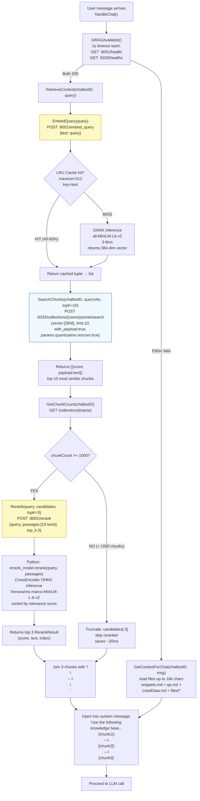
```mermaid
flowchart TD
    A["User message arrives\nhandleChat()"] --> B

    B["IsRAGAvailable()\n1s timeout each:\nGET :8001/health\nGET :6333/healthz"]

    B -- "Both 200" --> C["RetrieveContext(chatbotID, query)"]
    B -- "Either fails" --> Z["GetContextForChat(chatbotID, msg)\nread files up to 16k chars\nsnippets.md + qa.md +\ncrawlData.md + files/*"]

    C --> D["EmbedQuery(query)\nPOST :8001/embed_query\n{text: query}"]

    D --> E{"LRU Cache hit?\nmaxsize=512\nkey=text"}
    E -- "HIT (40-60%)" --> F["Return cached tuple → list"]
    E -- "MISS" --> G["ONNX inference\nall-MiniLM-L6-v2\n3-8ms\nreturns 384-dim vector"]
    G --> F

    F --> H["SearchChunks(chatbotID, queryVec, topK=10)\nPOST :6333/collections/{name}/points/search\n{vector:[384f], limit:10,\nwith_payload:true,\nparams.quantization.rescore:true}"]

    H --> I["Returns [{score, payload.text}]\ntop 10 most similar chunks"]

    I --> J["GetChunkCount(chatbotID)\nGET /collections/{name}"]

    J --> K{"chunkCount >= 1000?"}

    K -- "YES" --> L["Rerank(query, candidates, topK=3)\nPOST :8001/rerank\n{query, passages:[10 texts], top_k:3}"]

    L --> M["Python: rerank_model.rerank(query, passages)\nCrossEncoder ONNX inference\nXenova/ms-marco-MiniLM-L-6-v2\nsorted by relevance score"]

    M --> N["Returns top 3 RerankResult\n{score, text, index}"]

    K -- "NO (< 1000 chunks)" --> O["Truncate: candidates[:3]\nskip reranker\nsaves ~20ms"]

    N --> P["Join 3 chunks with '\\n\\n---\\n\\n'"]
    O --> P

    P --> Q["Inject into system message:\n'Use the following knowledge base...\n[chunk1]\\n---\\n[chunk2]\\n---\\n[chunk3]'"]

    Z --> Q

    Q --> R["Proceed to LLM call"]

    style D fill:#fef9c3,stroke:#ca8a04
    style H fill:#f0f9ff,stroke:#0369a1
    style L fill:#fef9c3,stroke:#ca8a04
```

---

## 11. LLM Provider Routing

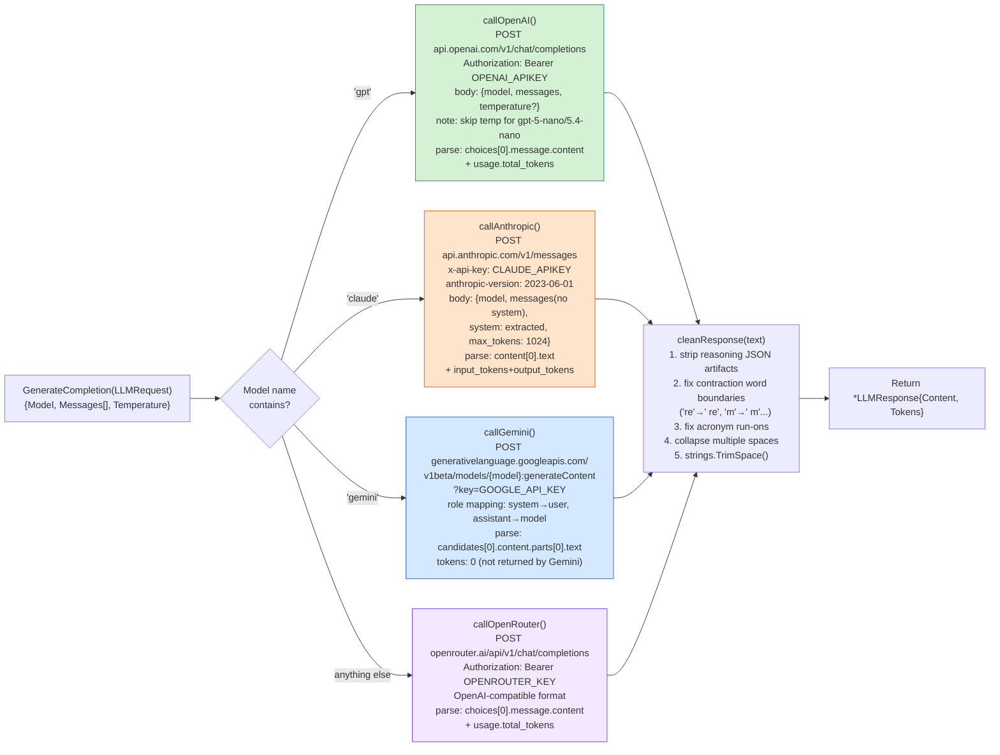
```mermaid
flowchart LR
    Req["GenerateCompletion(LLMRequest)\n{Model, Messages[], Temperature}"]

    Req --> Check{"Model name\ncontains?"}

    Check -- "'gpt'" --> OpenAI["callOpenAI()\nPOST api.openai.com/v1/chat/completions\nAuthorization: Bearer OPENAI_APIKEY\nbody: {model, messages, temperature?}\nnote: skip temp for gpt-5-nano/5.4-nano\nparse: choices[0].message.content\n+ usage.total_tokens"]

    Check -- "'claude'" --> Claude["callAnthropic()\nPOST api.anthropic.com/v1/messages\nx-api-key: CLAUDE_APIKEY\nanthropic-version: 2023-06-01\nbody: {model, messages(no system),\nsystem: extracted, max_tokens: 1024}\nparse: content[0].text\n+ input_tokens+output_tokens"]

    Check -- "'gemini'" --> Gemini["callGemini()\nPOST generativelanguage.googleapis.com/\nv1beta/models/{model}:generateContent\n?key=GOOGLE_API_KEY\nrole mapping: system→user, assistant→model\nparse: candidates[0].content.parts[0].text\ntokens: 0 (not returned by Gemini)"]

    Check -- "anything else" --> OpenRouter["callOpenRouter()\nPOST openrouter.ai/api/v1/chat/completions\nAuthorization: Bearer OPENROUTER_KEY\nOpenAI-compatible format\nparse: choices[0].message.content\n+ usage.total_tokens"]

    OpenAI --> Post["cleanResponse(text)\n1. strip reasoning JSON artifacts\n2. fix contraction word boundaries\n   ('re'→' re', 'm'→' m'...)\n3. fix acronym run-ons\n4. collapse multiple spaces\n5. strings.TrimSpace()"]

    Claude --> Post
    Gemini --> Post
    OpenRouter --> Post

    Post --> Ret["Return *LLMResponse{Content, Tokens}"]

    style OpenAI fill:#d4f1d4,stroke:#059669
    style Claude fill:#ffe4cc,stroke:#ea580c
    style Gemini fill:#d4e8ff,stroke:#2563eb
    style OpenRouter fill:#f3e8ff,stroke:#7c3aed
```

---

## 12. Knowledge Base Build & Retrain Flow

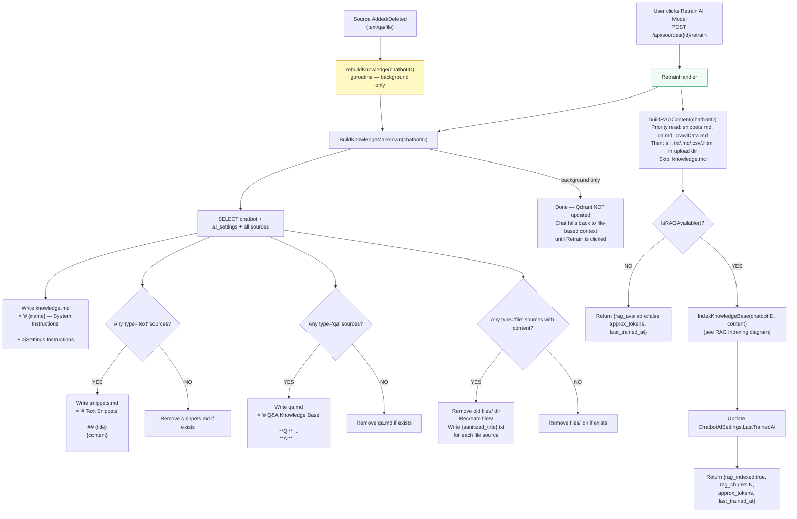
```mermaid
flowchart TD
    T1["Source Added/Deleted\n(text/qa/file)"] --> BG["rebuildKnowledge(chatbotID)\ngoroutine — background only"]
    T2["User clicks Retrain AI Model\nPOST /api/sources/{id}/retrain"] --> FULL

    BG --> BMD["BuildKnowledgeMarkdown(chatbotID)"]

    FULL["RetrainHandler"] --> BMD

    BMD --> R1["SELECT chatbot + ai_settings + all sources"]

    R1 --> W1["Write knowledge.md\n= '# {name} — System Instructions'\n\n+ aiSettings.Instructions"]

    R1 --> W2{"Any type='text' sources?"}
    W2 -- "YES" --> W2a["Write snippets.md\n= '# Text Snippets'\n\n## {title}\n{content}\n..."]
    W2 -- "NO" --> W2b["Remove snippets.md if exists"]

    R1 --> W3{"Any type='qa' sources?"}
    W3 -- "YES" --> W3a["Write qa.md\n= '# Q&A Knowledge Base'\n\n**Q:** ...\n**A:** ..."]
    W3 -- "NO" --> W3b["Remove qa.md if exists"]

    R1 --> W4{"Any type='file' sources with content?"}
    W4 -- "YES" --> W4a["Remove old files/ dir\nRecreate files/\nWrite {sanitized_title}.txt\nfor each file source"]
    W4 -- "NO" --> W4b["Remove files/ dir if exists"]

    BMD -- "background only" --> BGEnd["Done — Qdrant NOT updated\nChat falls back to file-based context\nuntil Retrain is clicked"]

    FULL --> FMD["buildRAGContent(chatbotID)\nPriority read: snippets.md, qa.md, crawlData.md\nThen: all .txt/.md/.csv/.html in upload dir\nSkip: knowledge.md"]

    FMD --> RAGCheck{"IsRAGAvailable()?"}

    RAGCheck -- "NO" --> FEnd["Return {rag_available:false,\napprox_tokens, last_trained_at}"]

    RAGCheck -- "YES" --> IDX["IndexKnowledgeBase(chatbotID, content)\n[see RAG Indexing diagram]"]

    IDX --> UPD["Update ChatbotAISettings.LastTrainedAt"]

    UPD --> FEnd2["Return {rag_indexed:true, rag_chunks:N,\napprox_tokens, last_trained_at}"]

    style BG fill:#fef9c3,stroke:#ca8a04
    style FULL fill:#f0fdf4,stroke:#059669
```

---

## 13. Data Source Ingestion

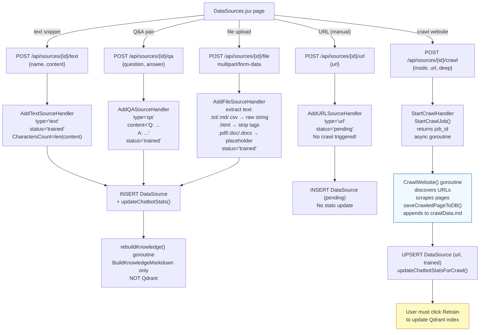
```mermaid
flowchart TD
    UI["DataSources.jsx page"]

    UI -- "text snippet" --> TS["POST /api/sources/{id}/text\n{name, content}"]
    UI -- "Q&A pair" --> QA["POST /api/sources/{id}/qa\n{question, answer}"]
    UI -- "file upload" --> FU["POST /api/sources/{id}/file\nmultipart/form-data"]
    UI -- "URL (manual)" --> UL["POST /api/sources/{id}/url\n{url}"]
    UI -- "crawl website" --> CW["POST /api/sources/{id}/crawl\n{mode, url, deep}"]

    TS --> TSH["AddTextSourceHandler\ntype='text'\nstatus='trained'\nCharactersCount=len(content)"]
    QA --> QAH["AddQASourceHandler\ntype='qa'\ncontent='Q: ...\nA: ...'\nstatus='trained'"]
    FU --> FUH["AddFileSourceHandler\nextract text:\n.txt/.md/.csv → raw string\n.html → strip tags\n.pdf/.doc/.docx → placeholder\nstatus='trained'"]
    UL --> ULH["AddURLSourceHandler\ntype='url'\nstatus='pending'\nNo crawl triggered!"]
    CW --> CWH["StartCrawlHandler\nStartCrawlJob()\nreturns job_id\nasync goroutine"]

    TSH --> DB["INSERT DataSource\n+ updateChatbotStats()"]
    QAH --> DB
    FUH --> DB
    ULH --> DB2["INSERT DataSource (pending)\nNo stats update"]
    CWH --> CWG["CrawlWebsite() goroutine\ndiscovers URLs\nscrapes pages\nsaveCrawledPageToDB()\nappends to crawlData.md"]

    DB --> RK["rebuildKnowledge() goroutine\nBuildKnowledgeMarkdown only\nNOT Qdrant"]

    CWG --> DB3["UPSERT DataSource (url, trained)\nupdateChatbotStatsForCrawl()"]

    DB3 --> Note["User must click Retrain\nto update Qdrant index"]

    style Note fill:#fef9c3,stroke:#ca8a04
    style CWG fill:#f0f9ff,stroke:#0369a1
```

---

## 14. Website Crawler Flow

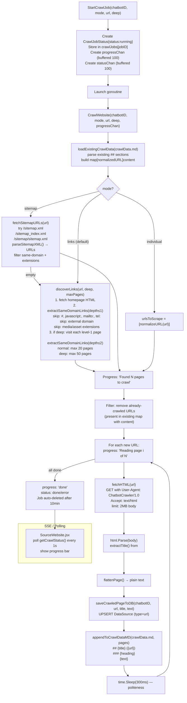
```mermaid
flowchart TD
    Start["StartCrawlJob(chatbotID, mode, url, deep)"]
    Start --> JobCreate["Create CrawlJobStatus{status:running}\nStore in crawlJobs[jobID]\nCreate progressChan (buffered 100)\nCreate statusChan (buffered 100)"]

    JobCreate --> Goroutine["Launch goroutine"]

    Goroutine --> CrawlWebsite["CrawlWebsite(chatbotID, mode, url, deep, progressChan)"]

    CrawlWebsite --> LoadExisting["loadExistingCrawlData(crawlData.md)\nparse existing ## sections\nbuild map[normalizedURL]content"]

    LoadExisting --> ModeCheck{"mode?"}

    ModeCheck -- "sitemap" --> SitemapFetch["fetchSitemapURLs(url)\ntry /sitemap.xml\n/sitemap_index.xml\n/sitemap/sitemap.xml\nparseSitemapXML() → URLs\nfilter same-domain + extensions"]

    SitemapFetch -- "empty" --> Links["discoverLinks (fallback)"]

    ModeCheck -- "individual" --> Single["urlsToScrape = [normalizeURL(url)]"]

    ModeCheck -- "links (default)" --> Links["discoverLinks(url, deep, maxPages)\n1. fetch homepage HTML\n2. extractSameDomainLinks(depth≤1)\n   skip: #, javascript:, mailto:, tel:\n   skip: external domain\n   skip: media/asset extensions\n3. if deep: visit each level-1 page\n   extractSameDomainLinks(depth≤2)\nnormal: max 20 pages\ndeep: max 50 pages"]

    Links --> DiscDone["Progress: 'Found N pages to crawl'"]
    SitemapFetch --> DiscDone
    Single --> DiscDone

    DiscDone --> FilterNew["Filter: remove already-crawled URLs\n(present in existing map with content)"]

    FilterNew --> ScrapLoop["For each new URL:\nprogress: 'Reading page i of N'"]

    ScrapLoop --> Fetch["fetchHTML(url)\nGET with User-Agent: ChatbotCrawler/1.0\nAccept: text/html\nlimit: 2MB body"]

    Fetch --> Parse["html.Parse(body)\nextractTitle() from <title>\nextractSections():\n  split at h1/h2/h3\n  skip: script,style,nav,header,footer\n  collect text nodes\n  filter sections < 30 chars"]

    Parse --> Flatten["flattenPage() → plain text"]

    Flatten --> SaveDB["saveCrawledPageToDB(chatbotID, url, title, text)\nUPSERT DataSource (type=url)"]

    SaveDB --> AppendMD["appendToCrawlDataMD(crawlData.md, pages)\n## {title} ({url})\n### {heading}\n{text}"]

    AppendMD --> Sleep["time.Sleep(300ms) — politeness"]

    Sleep --> ScrapLoop

    ScrapLoop -- "all done" --> Done["progress: 'done'\nstatus: done/error\nJob auto-deleted after 10min"]

    subgraph SSE["SSE / Polling"]
        Frontend["SourceWebsite.jsx\npoll getCrawlStatus() every 1s\nshow progress bar"]
    end

    Done --> Frontend
```

---

## 15. Sentiment Analysis Flow

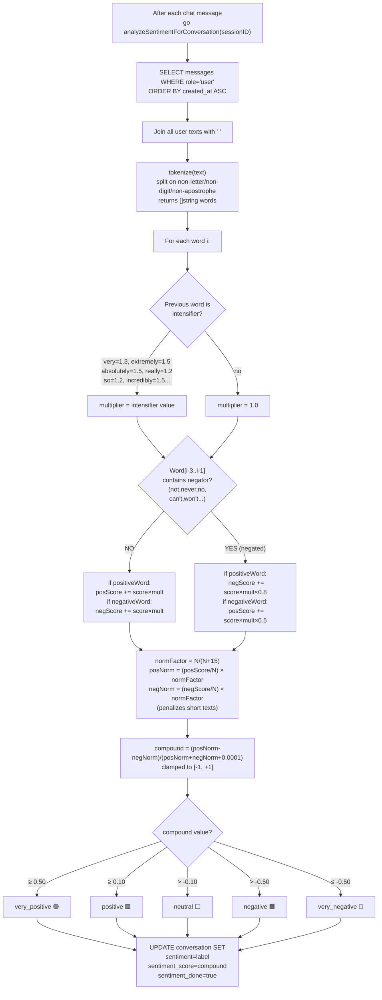
```mermaid
flowchart TD
    Trigger["After each chat message\ngo analyzeSentimentForConversation(sessionID)"]

    Trigger --> LoadMsgs["SELECT messages WHERE role='user'\nORDER BY created_at ASC"]

    LoadMsgs --> Join["Join all user texts with ' '"]

    Join --> Tokenize["tokenize(text)\nsplit on non-letter/non-digit/non-apostrophe\nreturns []string words"]

    Tokenize --> Score["For each word i:"]

    Score --> IntCheck{"Previous word is\nintensifier?"}
    IntCheck -- "very=1.3, extremely=1.5\nabsolutely=1.5, really=1.2\nso=1.2, incredibly=1.5..." --> Mult["multiplier = intensifier value"]
    IntCheck -- "no" --> Mult1["multiplier = 1.0"]
    Mult --> NegCheck
    Mult1 --> NegCheck

    NegCheck{"Word[i-3..i-1]\ncontains negator?\n(not,never,no,\ncan't,won't...)"} 

    NegCheck -- "YES (negated)" --> NegatedScore["if positiveWord:\n  negScore += score×mult×0.8\nif negativeWord:\n  posScore += score×mult×0.5"]

    NegCheck -- "NO" --> PosNegScore["if positiveWord:\n  posScore += score×mult\nif negativeWord:\n  negScore += score×mult"]

    PosNegScore --> Normalize
    NegatedScore --> Normalize

    Normalize["normFactor = N/(N+15)\nposNorm = (posScore/N) × normFactor\nnegNorm = (negScore/N) × normFactor\n(penalizes short texts)"]

    Normalize --> Compound["compound = (posNorm-negNorm)/(posNorm+negNorm+0.0001)\nclamped to [-1, +1]"]

    Compound --> Label{"compound value?"}

    Label -- "≥ 0.50" --> VP["very_positive 🟢"]
    Label -- "≥ 0.10" --> POS["positive 🟩"]
    Label -- "> -0.10" --> NEU["neutral ⬜"]
    Label -- "> -0.50" --> NEG["negative 🟧"]
    Label -- "≤ -0.50" --> VN["very_negative 🔴"]

    VP --> Update["UPDATE conversation SET\nsentiment=label\nsentiment_score=compound\nsentiment_done=true"]
    POS --> Update
    NEU --> Update
    NEG --> Update
    VN --> Update
```

---

## 16. Topic Classification Flow

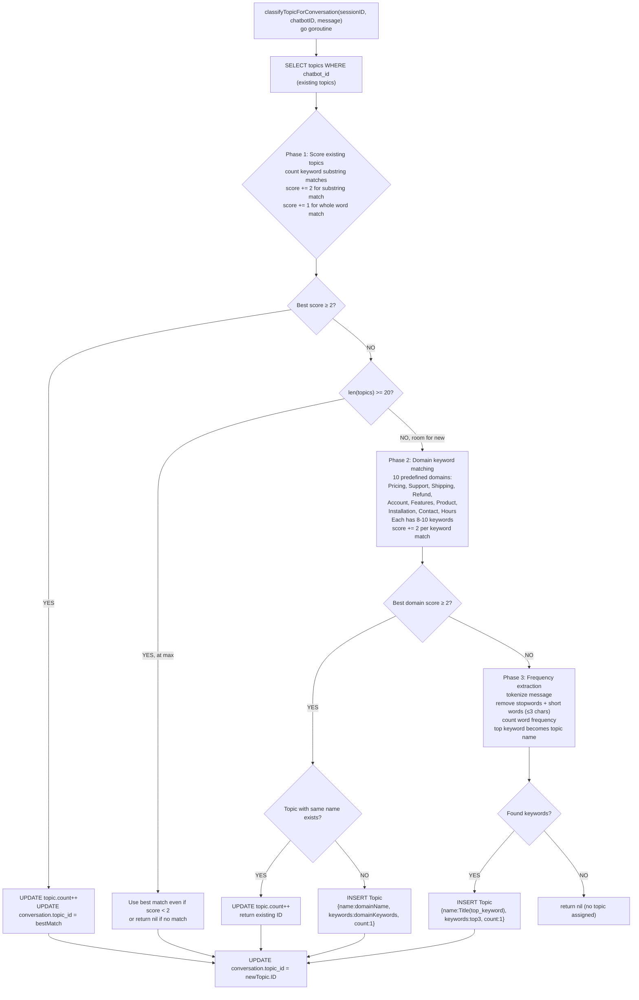
```mermaid
flowchart TD
    Trigger["classifyTopicForConversation(sessionID, chatbotID, message)\ngo goroutine"]

    Trigger --> Load["SELECT topics WHERE chatbot_id\n(existing topics)"]

    Load --> Phase1{"Phase 1: Score existing topics\ncount keyword substring matches\nscore += 2 for substring match\nscore += 1 for whole word match"}

    Phase1 --> BestScore{"Best score ≥ 2?"}

    BestScore -- "YES" --> UseExisting["UPDATE topic.count++\nUPDATE conversation.topic_id = bestMatch"]

    BestScore -- "NO" --> CapCheck{"len(topics) >= 20?"}

    CapCheck -- "YES, at max" --> UseBest["Use best match even if score < 2\nor return nil if no match"]

    CapCheck -- "NO, room for new" --> Phase2["Phase 2: Domain keyword matching\n10 predefined domains:\nPricing, Support, Shipping, Refund,\nAccount, Features, Product,\nInstallation, Contact, Hours\nEach has 8-10 keywords\nscore += 2 per keyword match"]

    Phase2 --> DomainScore{"Best domain score ≥ 2?"}

    DomainScore -- "YES" --> CheckExistingName{"Topic with same name exists?"}
    CheckExistingName -- "YES" --> IncrExisting["UPDATE topic.count++\nreturn existing ID"]
    CheckExistingName -- "NO" --> CreateDomain["INSERT Topic\n{name:domainName, keywords:domainKeywords, count:1}"]

    DomainScore -- "NO" --> Phase3["Phase 3: Frequency extraction\ntokenize message\nremove stopwords + short words (≤3 chars)\ncount word frequency\ntop keyword becomes topic name"]

    Phase3 --> FreqCheck{"Found keywords?"}

    FreqCheck -- "YES" --> CreateFreq["INSERT Topic\n{name:Title(top_keyword), keywords:top3, count:1}"]

    FreqCheck -- "NO" --> Nil["return nil (no topic assigned)"]

    CreateDomain --> UpdateConv["UPDATE conversation.topic_id = newTopic.ID"]
    CreateFreq --> UpdateConv
    IncrExisting --> UpdateConv
    UseExisting --> UpdateConv
    UseBest --> UpdateConv
```

---

## 17. Lead Capture System

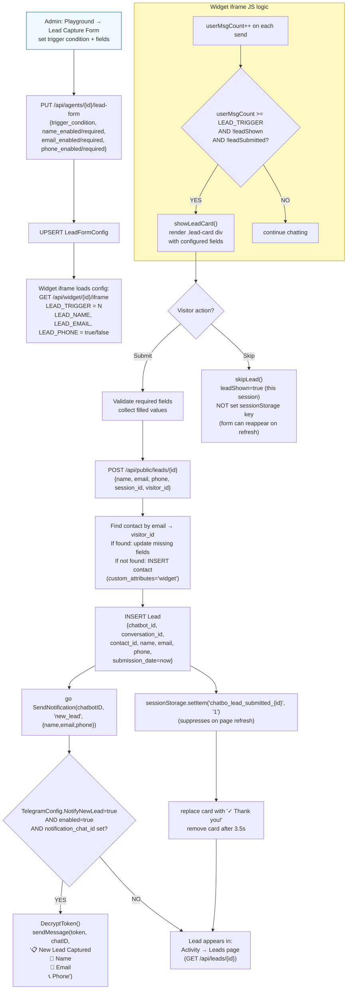
```mermaid
flowchart TD
    Admin["Admin: Playground → Lead Capture Form\nset trigger condition + fields"]

    Admin --> SaveCfg["PUT /api/agents/{id}/lead-form\n{trigger_condition, name_enabled/required,\nemail_enabled/required, phone_enabled/required}"]

    SaveCfg --> DB["UPSERT LeadFormConfig"]

    DB --> Widget["Widget iframe loads config:\nGET /api/widget/{id}/iframe\nLEAD_TRIGGER = N\nLEAD_NAME, LEAD_EMAIL, LEAD_PHONE = true/false"]

    subgraph WidgetJS["Widget iframe JS logic"]
        Track["userMsgCount++ on each send"]
        Check{"userMsgCount >= LEAD_TRIGGER\nAND !leadShown\nAND !leadSubmitted?"}
        Track --> Check
        Check -- "YES" --> ShowCard["showLeadCard()\nrender .lead-card div\nwith configured fields"]
        Check -- "NO" --> Wait["continue chatting"]
    end

    ShowCard --> UserAction{"Visitor action?"}

    UserAction -- "Submit" --> ValidReq["Validate required fields\ncollect filled values"]
    UserAction -- "Skip" --> SkipCard["skipLead()\nleadShown=true (this session)\nNOT set sessionStorage key\n(form can reappear on refresh)"]

    ValidReq --> PublicLead["POST /api/public/leads/{id}\n{name, email, phone, session_id, visitor_id}"]

    PublicLead --> DedupeContact["Find contact by email → visitor_id\nIf found: update missing fields\nIf not found: INSERT contact\n(custom_attributes='widget')"]

    DedupeContact --> InsertLead["INSERT Lead\n{chatbot_id, conversation_id,\ncontact_id, name, email, phone,\nsubmission_date=now}"]

    InsertLead --> Notify["go SendNotification(chatbotID, 'new_lead', {name,email,phone})"]

    Notify --> TelegramCheck{"TelegramConfig.NotifyNewLead=true\nAND enabled=true\nAND notification_chat_id set?"}

    TelegramCheck -- "YES" --> TGMsg["DecryptToken()\nsendMessage(token, chatID,\n'📋 New Lead Captured\n👤 Name\n📧 Email\n📞 Phone')"]

    TelegramCheck -- "NO" --> Done

    InsertLead --> SessionStore["sessionStorage.setItem('chatbo_lead_submitted_{id}', '1')\n(suppresses on page refresh)"]

    SessionStore --> ThankYou["replace card with '✓ Thank you!'\nremove card after 3.5s"]

    ThankYou --> Done["Lead appears in:\nActivity → Leads page\n(GET /api/leads/{id})"]

    style Admin fill:#f0f9ff,stroke:#0369a1
    style WidgetJS fill:#fef9c3,stroke:#ca8a04
```

---

## 18. Telegram Integration Flow

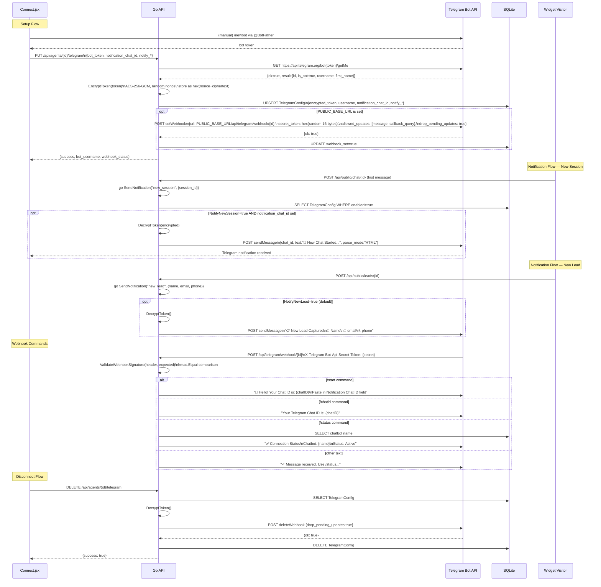
```mermaid
sequenceDiagram
    participant Admin as Connect.jsx
    participant API as Go API
    participant TG as Telegram Bot API
    participant DB as SQLite
    participant Visitor as Widget Visitor

    Note over Admin: Setup Flow
    Admin->>TG: (manual) /newbot via @BotFather
    TG-->>Admin: bot token
    Admin->>API: PUT /api/agents/{id}/telegram\n{bot_token, notification_chat_id, notify_*}
    API->>TG: GET https://api.telegram.org/bot{token}/getMe
    TG-->>API: {ok:true, result:{id, is_bot:true, username, first_name}}
    API->>API: EncryptToken(token)\nAES-256-GCM, random nonce\nstore as hex(nonce+ciphertext)
    API->>DB: UPSERT TelegramConfig\n{encrypted_token, username, notification_chat_id, notify_*}

    opt PUBLIC_BASE_URL is set
        API->>TG: POST setWebhook\n{url: PUBLIC_BASE_URL/api/telegram/webhook/{id},\nsecret_token: hex(random 16 bytes),\nallowed_updates: [message, callback_query],\ndrop_pending_updates: true}
        TG-->>API: {ok: true}
        API->>DB: UPDATE webhook_set=true
    end

    API-->>Admin: {success, bot_username, webhook_status}

    Note over Visitor: Notification Flow — New Session
    Visitor->>API: POST /api/public/chat/{id} (first message)
    API->>API: go SendNotification("new_session", {session_id})
    API->>DB: SELECT TelegramConfig WHERE enabled=true
    opt NotifyNewSession=true AND notification_chat_id set
        API->>API: DecryptToken(encrypted)
        API->>TG: POST sendMessage\n{chat_id, text:"💬 New Chat Started...", parse_mode:"HTML"}
        TG-->>Admin: Telegram notification received
    end

    Note over Visitor: Notification Flow — New Lead
    Visitor->>API: POST /api/public/leads/{id}
    API->>API: go SendNotification("new_lead", {name, email, phone})
    opt NotifyNewLead=true (default)
        API->>API: DecryptToken()
        API->>TG: POST sendMessage\n"📋 New Lead Captured\n👤 Name\n📧 email\n📞 phone"
    end

    Note over Admin: Webhook Commands
    TG->>API: POST /api/telegram/webhook/{id}\nX-Telegram-Bot-Api-Secret-Token: {secret}
    API->>API: ValidateWebhookSignature(header, expected)\nhmac.Equal comparison
    alt /start command
        API->>TG: "👋 Hello! Your Chat ID is: {chatID}\nPaste in Notification Chat ID field"
    else /chatid command
        API->>TG: "Your Telegram Chat ID is: {chatID}"
    else /status command
        API->>DB: SELECT chatbot name
        API->>TG: "✅ Connection Status\nChatbot: {name}\nStatus: Active"
    else other text
        API->>TG: "✓ Message received. Use /status..."
    end

    Note over Admin: Disconnect Flow
    Admin->>API: DELETE /api/agents/{id}/telegram
    API->>DB: SELECT TelegramConfig
    API->>API: DecryptToken()
    API->>TG: POST deleteWebhook {drop_pending_updates:true}
    TG-->>API: {ok: true}
    API->>DB: DELETE TelegramConfig
    API-->>Admin: {success: true}
```

---

## 19. Widget Embedding System

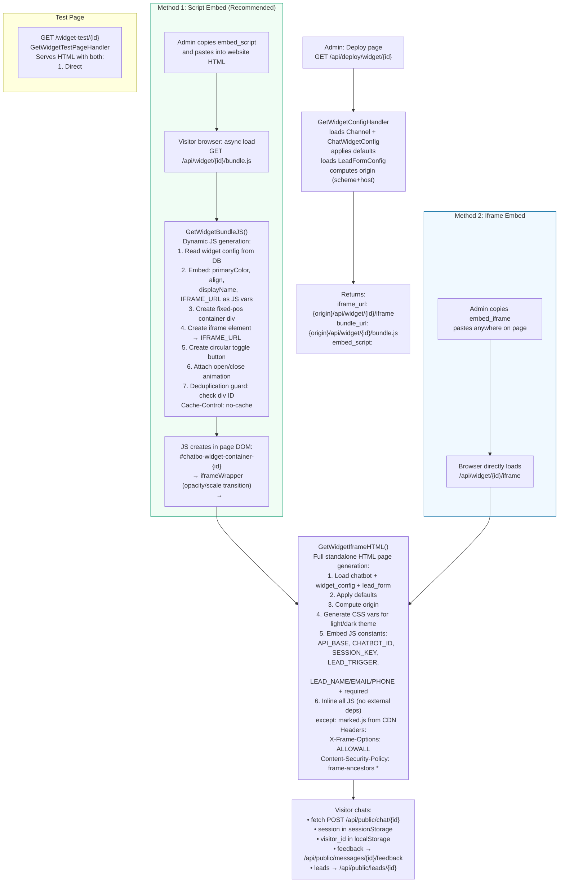
```mermaid
flowchart TD
    Admin["Admin: Deploy page\nGET /api/deploy/widget/{id}"]

    Admin --> Config["GetWidgetConfigHandler\nloads Channel + ChatWidgetConfig\napplies defaults\nloads LeadFormConfig\ncomputes origin (scheme+host)"]

    Config --> EmbedOptions["Returns:\niframe_url: {origin}/api/widget/{id}/iframe\nbundle_url: {origin}/api/widget/{id}/bundle.js\nembed_script: <script> loader\nembed_iframe: <iframe> tag\nlead_form config"]

    subgraph Method1["Method 1: Script Embed (Recommended)"]
        CopyScript["Admin copies embed_script\nand pastes into website HTML"]
        CopyScript --> LoadBundle["Visitor browser: async load\nGET /api/widget/{id}/bundle.js"]
        LoadBundle --> BundleGen["GetWidgetBundleJS()\nDynamic JS generation:\n1. Read widget config from DB\n2. Embed: primaryColor, align,\n   displayName, IFRAME_URL as JS vars\n3. Create fixed-pos container div\n4. Create iframe element → IFRAME_URL\n5. Create circular toggle button\n6. Attach open/close animation\n7. Deduplication guard: check div ID\nCache-Control: no-cache"]
        BundleGen --> DOM["JS creates in page DOM:\n#chatbo-widget-container-{id}\n  → iframeWrapper (opacity/scale transition)\n    → <iframe src=IFRAME_URL>\n  → <button> (primary color, contrast text)\n     toggle: isOpen !isOpen\n     icons: chat SVG ↔ close SVG"]
    end

    subgraph Method2["Method 2: Iframe Embed"]
        CopyIframe["Admin copies embed_iframe\npastes anywhere on page"]
        CopyIframe --> DirectIframe["Browser directly loads\n/api/widget/{id}/iframe"]
    end

    DOM --> IframeLoad
    DirectIframe --> IframeLoad

    IframeLoad["GetWidgetIframeHTML()\nFull standalone HTML page generation:\n1. Load chatbot + widget_config + lead_form\n2. Apply defaults\n3. Compute origin\n4. Generate CSS vars for light/dark theme\n5. Embed JS constants:\n   API_BASE, CHATBOT_ID,\n   SESSION_KEY, LEAD_TRIGGER,\n   LEAD_NAME/EMAIL/PHONE + required\n6. Inline all JS (no external deps)\n   except: marked.js from CDN\nHeaders:\n   X-Frame-Options: ALLOWALL\n   Content-Security-Policy: frame-ancestors *"]

    IframeLoad --> VisitorChat["Visitor chats:\n• fetch POST /api/public/chat/{id}\n• session in sessionStorage\n• visitor_id in localStorage\n• feedback → /api/public/messages/{id}/feedback\n• leads → /api/public/leads/{id}"]

    subgraph TestPage["Test Page"]
        TestURL["GET /widget-test/{id}\nGetWidgetTestPageHandler\nServes HTML with both:\n1. Direct <iframe> embed\n2. <script> embed (floating button)"]
    end

    style Method1 fill:#f0fdf4,stroke:#059669
    style Method2 fill:#f0f9ff,stroke:#0369a1
```

---

## 20. Frontend App Bootstrap

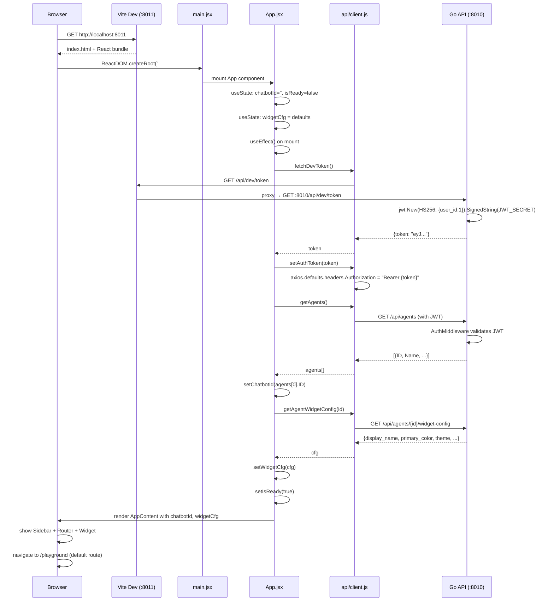
```mermaid
sequenceDiagram
    participant Browser as Browser
    participant Vite as Vite Dev (:8011)
    participant MainJSX as main.jsx
    participant AppJSX as App.jsx
    participant Client as api/client.js
    participant API as Go API (:8010)

    Browser->>Vite: GET http://localhost:8011
    Vite-->>Browser: index.html + React bundle
    Browser->>MainJSX: ReactDOM.createRoot('#root').render(<App/>)

    MainJSX->>AppJSX: mount App component
    AppJSX->>AppJSX: useState: chatbotId='', isReady=false
    AppJSX->>AppJSX: useState: widgetCfg = defaults

    AppJSX->>AppJSX: useEffect() on mount

    AppJSX->>Client: fetchDevToken()
    Client->>Vite: GET /api/dev/token
    Vite->>API: proxy → GET :8010/api/dev/token
    API->>API: jwt.New(HS256, {user_id:1}).SignedString(JWT_SECRET)
    API-->>Client: {token: "eyJ..."}
    Client-->>AppJSX: token

    AppJSX->>Client: setAuthToken(token)
    Client->>Client: axios.defaults.headers.Authorization = "Bearer {token}"

    AppJSX->>Client: getAgents()
    Client->>API: GET /api/agents (with JWT)
    API->>API: AuthMiddleware validates JWT
    API-->>Client: [{ID, Name, ...}]
    Client-->>AppJSX: agents[]

    AppJSX->>AppJSX: setChatbotId(agents[0].ID)

    AppJSX->>Client: getAgentWidgetConfig(id)
    Client->>API: GET /api/agents/{id}/widget-config
    API-->>Client: {display_name, primary_color, theme, ...}
    Client-->>AppJSX: cfg

    AppJSX->>AppJSX: setWidgetCfg(cfg)
    AppJSX->>AppJSX: setIsReady(true)

    AppJSX->>Browser: render AppContent with chatbotId, widgetCfg
    Browser->>Browser: show Sidebar + Router + Widget
    Browser->>Browser: navigate to /playground (default route)
```

---

## 21. Frontend Page & Component Tree

```mermaid
graph TD
    App["App.jsx\nchatbotId state\nwidgetCfg state\nisReady state"]

    App --> Router["BrowserRouter"]
    Router --> AppContent["AppContent component\n(useLocation for right panel visibility)"]

    AppContent --> Sidebar["Sidebar.jsx\nNavLink navigation\n9 top-level items\n3 group headers"]

    AppContent --> Middle["Middle Panel (Routes)"]
    AppContent --> Right["Right Panel (conditional)\ndisplay:none on non-playground/settings"]

    Right --> Widget["Widget.jsx\nexternalCfg prop (live updates)\n\nStates:\nmessages[]\ninput, sessionId\nisLoading, feedbackSent{}\nleadConfig, showLeadForm\nuserMsgCount, leadDismissed\nwidgetCfg (theme, colors)\n\nUses:\nReactMarkdown + remarkGfm\nsendChatMessage()\nsubmitFeedback()\ngetLeadFormConfig()\ncreateContact()"]

    Widget --> LeadCard["LeadCard sub-component\nname/email/phone inputs\ncreateContact() on submit"]

    Middle --> PG["Playground.jsx\ngetAgentSettings()\nupdateAgentSettings()\nretrainModel()\ngetSourceStats()\ngetRagHealth()\ngetLeadFormConfig()\nupdateLeadFormConfig()"]

    Middle --> ST["Settings.jsx\ngetAgentWidgetConfig()\nupdateAgentWidgetConfig() → onWidgetConfigSaved\ncreateChatbot()\ndeleteChatbot()\ndeleteConversations()"]

    Middle --> ACT["Activity.jsx\n\nActivityLogs:\ngetChatHistory()\ngetSessionDetail()\nSplit-pane layout\nSessionDetail sub-component\n\nActivityLeads:\ngetLeads()\nexport CSV"]

    Middle --> AN["Analytics.jsx\n\nAnalyticsChats:\ngetAnalytics()\nLineChart (Recharts)\nClickable feedback cards\n\nAnalyticsTopics:\ngetTopicsAnalytics()\nPieChart + BarChart\n\nAnalyticsSentiments:\ngetSentimentsAnalytics()\nStacked bar + PieChart"]

    Middle --> DS["DataSources.jsx\n\nSourceFiles:\naddFileSource() drag+drop\n\nSourceText:\naddTextSource()\n\nSourceWebsite:\nstartCrawl()\ngetCrawlStatus() polling 1s\ngetCrawledSources()\n\nSourceQA:\naddQASource()\nbulk CSV upload\n\nAll: ContextStatsBar\ngetSourceStats()"]

    Middle --> DEP["Deploy.jsx\ngetWidgetConfig()\nShowsembed_script\nembed_iframe\nbundle_url, iframe_url\nCopyButton component"]

    Middle --> CON["Contacts.jsx\ngetContacts()\ncreateContact()\ndeleteContact()"]

    Middle --> CONN["Connect.jsx\ngetTelegramConfig()\nsaveTelegramConfig()\ndisconnectTelegram()\n\nSub-components:\nTelegramIcon SVG\nStatusBadge\nToggle switch"]
```

---

## 22. Analytics Data Flow

```mermaid
flowchart LR
    subgraph Inputs["Data Creation Events"]
        NewChat["New chat session started\n→ INSERT Conversation"]
        NewMsg["Message sent/received\n→ INSERT Message (×2)"]
        Feedback["Feedback submitted\n→ UPDATE Message.feedback"]
        SentimentRun["Async sentiment analysis\n→ UPDATE Conversation.sentiment"]
        TopicRun["Async topic classification\n→ UPDATE Conversation.topic_id\n→ UPDATE Topic.count"]
        DailyUpdate["Daily stats updated:\n→ UPSERT ChatbotDailyStats"]
    end

    subgraph DB["SQLite Database"]
        Conversations["conversations table\nsentiment, topic_id, contact_id\nstarted_at, source"]
        Messages["messages table\nrole, feedback\ncreated_at, model"]
        Topics["topics table\nname, keywords, count"]
        DailyStats["chatbot_daily_stats table\ntotal_chats, total_messages\nthumb_up, thumb_down\ndate (unique per chatbot)"]
    end

    subgraph APILayer["API Endpoints"]
        OverviewAPI["GET /api/analytics/{id}\nCOUNT conversations\nCOUNT messages\nCOUNT feedback good/bad\nCOUNT DISTINCT contact_id\n7-day loop (conv+msg per day)"]
        TopicsAPI["GET /api/analytics/{id}/topics\nSELECT topics ORDER BY count\nCOUNT conv per topic"]
        SentimentAPI["GET /api/analytics/{id}/sentiments\nCOUNT conv per sentiment label\ncalculate percentages"]
        LeadsAPI["GET /api/leads/{id}\nSELECT leads ORDER BY created_at"]
    end

    subgraph Frontend["Frontend Charts (Recharts)"]
        LineC["LineChart\n7-day: sessions + messages"]
        PieT["PieChart + BarChart\ntopic distribution"]
        StackedB["Stacked bar + PieChart\nsentiment breakdown"]
        Table["Leads table\nexport CSV"]
    end

    NewChat --> Conversations
    NewMsg --> Messages
    NewChat --> DailyUpdate
    NewMsg --> DailyUpdate
    Feedback --> Messages
    Feedback --> DailyUpdate
    SentimentRun --> Conversations
    TopicRun --> Conversations
    TopicRun --> Topics

    Conversations --> OverviewAPI
    Messages --> OverviewAPI
    Conversations --> SentimentAPI
    Topics --> TopicsAPI
    Conversations --> TopicsAPI
    DailyStats --> OverviewAPI

    OverviewAPI --> LineC
    TopicsAPI --> PieT
    SentimentAPI --> StackedB
    LeadsAPI --> Table

    OverviewAPI -- "click feedback card" --> ChatLogs["Navigate to /activity/chats\n?feedback=good or bad\nfilters sessions"]
```

---

## 23. Contacts Flow

```mermaid
flowchart TD
    subgraph Creation["Contact Creation Paths"]
        Manual["Admin: Contacts page\nPOST /api/contacts/{id}\n{name, email, phone, source='manual'}\nCustomAttributes='manual'"]

        Widget["Widget: First visit\npublicChatHandler\nresolveOrCreateContact(chatbotID, visitor_id)\nCustomAttributes=''"]

        Lead["Lead form submission\nSubmitPublicLeadHandler\nfind by email → visitor_id\nif not found: INSERT\nCustomAttributes='widget'"]

        Preview["Admin Widget preview\nLeadCard.handleSubmit()\nPOST /api/contacts/{id}\nCustomAttributes='widget_preview'"]
    end

    subgraph Storage["contacts table"]
        ContactDB["Contact {\n  ID (UUID)\n  ChatbotID\n  ExternalID (visitor_id)\n  Email, Phone, Name\n  CustomAttributes (source)\n  CreatedAt\n}"]
    end

    Manual --> ContactDB
    Widget --> ContactDB
    Lead --> ContactDB
    Preview --> ContactDB

    subgraph LLMContext["LLM Context Injection"]
        LoadCtx["LoadContactsContext(chatbotID)\nSELECT contacts WHERE\ncustom_attributes IN ('manual','csv_import')\nBuilds:\n'## Contact Directory\n- Name: X | Email: Y | Phone: Z'"]
        SystemMsg["Injected into LLM system prompt\nAllows chatbot to answer:\n'What is John's phone number?'"]
    end

    ContactDB --> LoadCtx
    LoadCtx --> SystemMsg

    subgraph AdminView["Admin: Contacts page"]
        GetContacts["GET /api/contacts/{id}\nSELECT WHERE chatbot_id\nORDER BY created_at DESC"]
        DelContact["DELETE /api/contacts/{contact_id}"]
    end

    ContactDB --> GetContacts
    ContactDB --> DelContact
```

---

## 24. Session & Daily Stats Update Flow

```mermaid
flowchart TD
    ChatReq["POST /api/chat/{id} or /api/public/chat/{id}"]

    ChatReq --> NewSession{"session_id in request?"}

    NewSession -- "NO (new visitor)" --> CreateConv["INSERT Conversation\n{chatbot_id, source, started_at, contact_id}"]
    CreateConv --> DailyChat["updateDailyStatsChat(chatbotID)\nUPSERT ChatbotDailyStats\nWHERE date=today\nSET total_chats++"]

    NewSession -- "YES (returning)" --> SkipConv["Use existing conversation_id"]

    DailyChat --> SaveMsgs["INSERT Message (role=user)\n... LLM call ...\nINSERT Message (role=assistant)"]
    SkipConv --> SaveMsgs

    SaveMsgs --> DailyMsg["updateDailyStatsMessages(chatbotID, 2)\nUPDATE ChatbotDailyStats\nSET total_messages += 2"]

    DailyMsg --> FeedbackPath["User submits feedback\nPOST /api/messages/{id}/feedback\n{feedback: 'good'|'bad'}"]

    FeedbackPath --> UpdateMsg["UPDATE Message SET feedback"]

    UpdateMsg --> FeedbackStats["Find Conversation → ChatbotID\nUPSERT ChatbotDailyStats\nif good: messages_thumb_up++\nif bad: messages_thumb_down++"]

    subgraph Async["Async Analytics (goroutine)"]
        SentAsync["analyzeSentimentForConversation\n→ UPDATE Conversation\n   sentiment, score, done"]
        TopicAsync["classifyTopicForConversation\n→ INSERT/UPDATE Topic\n→ UPDATE Conversation.topic_id"]
    end

    SaveMsgs --> Async

    subgraph Query["Analytics Query Time"]
        Q1["7-day loop: COUNT(conversations)\nWHERE started_at >= dayStart\nAND started_at < dayEnd"]
        Q2["COUNT(DISTINCT contact_id)\nWHERE chatbot_id"]
        Q3["COUNT(messages)\nJOIN conversations\nWHERE feedback='good'/'bad'"]
    end
```

---

## 25. Complete Request Lifecycle

```mermaid
flowchart TD
    subgraph VisitorFlow["Visitor Lifecycle (Embedded Widget)"]
        V1["Visitor lands on website with embed script"]
        V1 --> V2["Browser loads bundle.js\nCreates iframe + toggle button"]
        V2 --> V3["iframe loads full chat HTML\n(knowledge config embedded as JS)"]
        V3 --> V4["Visitor clicks button → opens chat\nShows initial greeting message"]
        V4 --> V5["Visitor types first message"]
        V5 --> V6["POST /api/public/chat/{id}\n{message, visitor_id}"]
        V6 --> V7["Backend:\n1. Create Contact (visitor_id)\n2. Create Conversation\n3. Notify Telegram (if configured)\n4. RAG retrieval\n5. LLM generation\n6. Save messages\n7. Async: sentiment + topic"]
        V7 --> V8["Return {session_id, response}"]
        V8 --> V9["Visitor sees AI response\n(Markdown rendered)"]
        V9 --> V10{"After N messages?"}
        V10 -- "YES" --> V11["Lead form appears\n(after AI response, 600ms delay)"]
        V11 --> V12["Visitor submits form\nPOST /api/public/leads/{id}"]
        V12 --> V13["Lead saved\nTelegram notification sent"]
        V10 -- "NO" --> V5
    end

    subgraph AdminFlow["Admin Lifecycle"]
        A1["Admin opens dashboard"]
        A1 --> A2["App.jsx:\nfetch dev token → set auth\nfetch agents → get first agent ID\nfetch widget config → load preview"]
        A2 --> A3["Admin configures agent:\n• Playground: set model, temp, instructions\n• Settings: widget colors, theme, name\n• Sources: add files/text/QA/crawl website"]
        A3 --> A4["Admin retrains:\nPOST /api/sources/{id}/retrain\nBuilds knowledge.md files\nIndexes into Qdrant (if RAG available)"]
        A4 --> A5["Admin tests in Widget preview\n(right panel, live updates)"]
        A5 --> A6["Admin deploys:\nDeploy page → copies embed script\nor iframe tag"]
        A6 --> A7["Admin monitors:\n• Activity → Chat Logs (sessions + messages)\n• Activity → Leads\n• Analytics → Charts\n• Connect → Telegram notifications"]
    end

    subgraph DataFlow["Data Architecture Summary"]
        SQLite["SQLite DB\nConversations + Messages\nContacts + Leads\nTopics + Sentiments\nDaily Stats\nWidget Config\nTelegram Config"]

        Files["File System\nlocal/uploads/{id}/\nknowledge.md (instructions)\nsnippets.md (text sources)\nqa.md (Q&A sources)\ncrawlData.md (website)\nfiles/ (uploaded files)"]

        Qdrant["Qdrant\nOne collection per chatbot\nchatbot_{id}_*\n384-dim INT8 vectors\nchunk text in payload"]

        Chat["Chat Request\n↓\nSystem: instructions + MD rules\n+ contacts directory\n↓\nKnowledge: RAG chunks OR files\n↓\nHistory: all prior messages\n↓\nUser: current message\n→ LLM → response"]
    end

    SQLite --> Chat
    Files --> Chat
    Qdrant --> Chat
```

---

*All diagrams generated from full source code analysis. Each diagram accurately reflects the actual implementation.*
